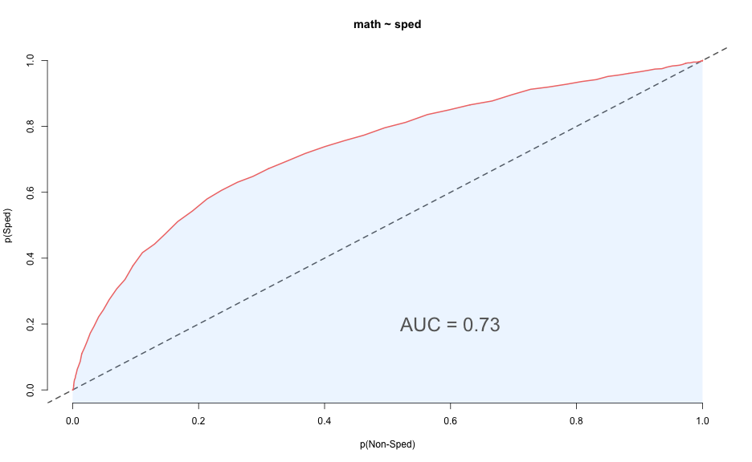
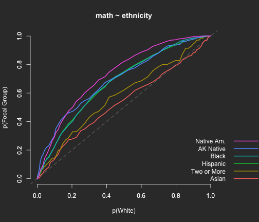
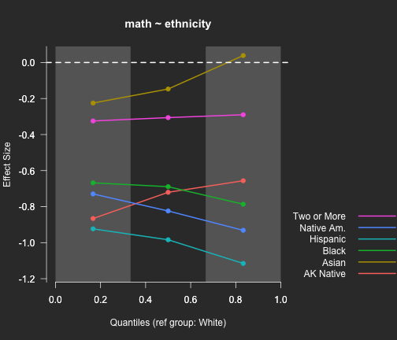

---
title       : Visualizing Effect Sizes Across the Full Distribution
subtitle    : Daniel Anderson,  Joseph Stevens,  Joseph Nese 
author      : Univeristy of Oregon
framework   : io2012        # {io2012, html5slides, shower, dzslides, ...}
highlighter : highlight.js  # {highlight.js, prettify, highlight}
hitheme     : hemisu-light      # 
widgets     : [mathjax]            # {mathjax, quiz, bootstrap}
mode        : selfcontained # {standalone, draft}
knit        : slidify::knit2slides
--- .quote
<style>
em {
  font-style: italic
}
</style>

<style>
strong {
  font-weight: bold;
}
</style>


## Background
* Effect sizes generally defined by standardized mean differences
    + Cohen's *d*
    + Hedges' *g*
* Particularly in non-experimental settings, interest may lie at other locations of the scale
    + Achievement gaps at proficiency cut scores on statewide tests
* Depending on the shape of each distribution, magnitude of group differences may depend upon scale location

---- &twocol
## Cohen's *d* & Hedges' *g*

<br>
<br>
<br>
<br>

*** =left

$$d = \frac{\bar{X}_{foc} - \bar{X}_{ref}}
        {\sqrt{\frac{(n_{foc} - 1)Var_{foc} + (n_{ref} - 1)Var_{ref}}
                  {n_{foc} + n_{ref} - 2}}}$$

*** =right

$$g = d\Big(1 - \frac{3}{4(n_{foc} + n_{ref}) - 9}\Big)$$

---- &twocol
## Percentage above the cut effect sizes

*** =left
# Percentage Above the Cut
$$d^{pac} = PAC_{ref} - PAC_{foc}$$
* Highly dependent on scale location

*** =right
# Transformed Percentage Above the Cut
$$d^{tpac} = \Phi^{-1}(PAC_{ref}) - \Phi^{-1}(PAC_{foc})$$
* Assumes both distributions are normally distributed with equal variance

---- &twocol
## Probability-Probability Plots


*** =left


*** =right


----
## Area Under the PP Curve



----
## Putting AUC in SD units 
<span style="color:gray">Ho and colleagues</span>
<br>

$$V = \sqrt{2}\Phi^{-1}(AUC)$$ 

* Scale invariant
* Assumes respective normality
	+ Normal with respect to each other under a shared transformation 


<br>

* *AUC* and *V* make fewer assumptions about the data, but are nonetheless summary measures.
* May miss nuances in the data that can be picked up by visualizations - particularly if the magnitude of the effect depends on scale location.

---- .segue
# Implementation in `esvis`


---- &twocol
## R package actively in development

*** =left

* Install using the *devtools* package


```r
install.packages("devtools")
library(devtools) 
install_github("DJAnderson07/esvis")
```

* Release to CRAN planned for summer
* Has many useful features currently

<br>

See current development at 

https://github.com/DJAnderson07/esvis

*** =right


----
## Example data

I have stored a dataset in an object called `d`. Below are the first six rows of these data.


```
##         sid cohort     sped  ethnicity frl     ell season reading math
## 2873 332347      1 Non-Sped   Hispanic FRL  Active Spring     167  192
## 162  400047      1 Non-Sped Native Am. FRL Non-ELL Spring     191  191
## 355  400047      1 Non-Sped Native Am. FRL Non-ELL   Fall     183  182
## 387  400047      1 Non-Sped Native Am. FRL Non-ELL Winter     178  179
## 230  400277      1 Non-Sped Native Am. FRL Non-ELL Winter     199  197
## 648  400277      1 Non-Sped Native Am. FRL Non-ELL   Fall     203  196
```


----
## Standard argument structure
* All functions in *esvis* take a common argument structure, as follows


```r
fun_name(outcome ~ group, data, additional_optional_args)
```

---- &twocol
## PP Plots

*** =left

* Examine math differences by free or reduced lunch status


```r
pp_plot(math ~ frl, d)
```

* Notice shading by default when only two groups are compared.
* *AUC* and *V* annotated to the plot, by default
* Plot is fully customizable with calls to base plotting functions (e.g., `main`, `col`, etc.)

*** =right


----
## More than one group?
* Highest performing group selected by default


```r
pp_plot(reading ~ ethnicity, d)
```


----
## Change reference group
* Investigate differences by ELL Classification


```r
pp_plot(reading ~ ell, d, ref_group = "Non-ELL")
```


----
## ECDFs
* Produced equivalently


```r
ecdf_plot(reading ~ ell, d)
```


----
## Cut-point?


```r
ecdf_plot(reading ~ ell, d, ref_cut = c(190, 200, 207))
```


----
## Add horizontal reference lines


```r
ecdf_plot(reading ~ ell, d, ref_cut = c(190, 200, 207), hor_ref = TRUE)
```


----
## Binned ES Plot

* Split each distribution into arbitrary (even) quantile bins
* Calculate mean difference within each bin
* Divide by overall pooled standard deviation

$$d_{[i]} = \frac{\bar{X}_{foc_{[i]}} - \bar{X}_{ref_{[i]}}}
        {\sqrt{\frac{(n_{foc} - 1)Var_{foc} + (n_{ref} - 1)Var_{ref}}
                  {n_{foc} + n_{ref} - 2}}}$$

* In this case, essentially equivalent to Cohen's *d*, except that there are multiple mean differences (one for each bin)

----
## Ethnicity differences


```r
binned_plot(math ~ ethnicity, d)
```


----
## Change binning
Quintile binning


```r
binned_plot(math ~ ethnicity, d, qtiles = seq(0, 1, .2))
```


----
## Change reference group


```r
binned_plot(math ~ ethnicity, d, ref_group = "Black", qtiles = seq(0, 1, .2))
```


---- &twocol
## Themes (last note on plots)
* Currently standard and dark themes implemented

*** =left


```r
binned_plot(math ~ ethnicity, d)
```



*** =right


```r
binned_plot(math ~ ethnicity, d, theme = "dark")
```



----
# Estimation (quickly)
`esvis` will also calculate a number of effect sizes using the same argument structure, including:
* Cohen's *d*
* Hedges' *g*
* *AUC*
* *V*
* *PAC* with **any set** of cut scores
* *TPAC* with **one** cut score (currently)

By default, effect sizes are produced for all possible pairwise comparisons, but reference groups can be selected as well.

---- &twocol

*** =left


```r
coh_d(math ~ ethnicity, d)
```

```
##      ref_group   foc_group    estimate
## 1        White       Asian  0.10689571
## 2        White Two or More  0.30281232
## 3        White    Hispanic  1.03147010
## 4        White       Black  0.72127040
## 5        White  Am. Indian  0.76483392
## 6        White  Native Am.  0.84185433
## 7        Asian Two or More  0.07471180
## 8        Asian    Hispanic  0.72590767
## 9        Asian       Black  0.39210777
## 10       Asian  Am. Indian  0.29878405
## 11       Asian  Native Am.  0.39455423
## 12 Two or More    Hispanic  0.40811606
## 13 Two or More       Black  0.21475724
## 14 Two or More  Am. Indian  0.16297587
## 15 Two or More  Native Am.  0.24174797
## 16    Hispanic       Black  0.02423883
## 17    Hispanic  Am. Indian  0.25579261
## 18    Hispanic  Native Am.  0.30800593
## 19       Black  Am. Indian  0.12256685
## 20       Black  Native Am.  0.15962973
## 21  Am. Indian  Native Am.  0.01700166
## 22  Native Am.  Am. Indian -0.01700166
## 23  Native Am.       Black -0.15962973
## 24  Native Am.    Hispanic -0.30800593
## 25  Native Am. Two or More -0.24174797
## 26  Native Am.       Asian -0.39455423
## 27  Native Am.       White -0.84185433
## 28  Am. Indian       Black -0.12256685
## 29  Am. Indian    Hispanic -0.25579261
## 30  Am. Indian Two or More -0.16297587
## 31  Am. Indian       Asian -0.29878405
## 32  Am. Indian       White -0.76483392
## 33       Black    Hispanic -0.02423883
## 34       Black Two or More -0.21475724
## 35       Black       Asian -0.39210777
## 36       Black       White -0.72127040
## 37    Hispanic Two or More -0.40811606
## 38    Hispanic       Asian -0.72590767
## 39    Hispanic       White -1.03147010
## 40 Two or More       Asian -0.07471180
## 41 Two or More       White -0.30281232
## 42       Asian       White -0.10689571
```

*** =right


```r
coh_d(math ~ ethnicity, d, "White")
```

```
##   ref_group   foc_group  estimate
## 1     White       Asian 0.1068957
## 2     White Two or More 0.3028123
## 3     White    Hispanic 1.0314701
## 4     White       Black 0.7212704
## 5     White  Am. Indian 0.7648339
## 6     White  Native Am. 0.8418543
```

----

```r
pac(math ~ ethnicity, d, cut = c(190, 200, 207), ref_group = "White")
```

```
##    ref_group   foc_group cut    estimate
## 1      White       Asian 190 0.091192628
## 2      White Two or More 190 0.105914547
## 3      White    Hispanic 190 0.204674477
## 4      White       Black 190 0.194817998
## 5      White  Am. Indian 190 0.281166804
## 6      White  Native Am. 190 0.293704535
## 22     White       Asian 200 0.067726906
## 23     White Two or More 200 0.138174016
## 24     White    Hispanic 200 0.265801628
## 25     White       Black 200 0.258117222
## 26     White  Am. Indian 200 0.262496905
## 27     White  Native Am. 200 0.328528106
## 43     White       Asian 207 0.006063335
## 44     White Two or More 207 0.085670751
## 45     White    Hispanic 207 0.183788361
## 46     White       Black 207 0.182983988
## 47     White  Am. Indian 207 0.180997357
## 48     White  Native Am. 207 0.241836807
```

----
## Summary and future developments
* Visualizing group differences across the full scale, or at particular points of the scale, is important for interpretation and communication.
* `esvis` provides a simple interface to produce powerful visualizations

# Future development
* Interactions with `:`
* Interactions via panel plotting
* Others?

---- .segue
# Thanks!
